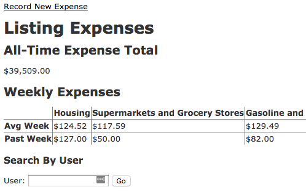

# Expense Tracker
This is a very basic expense tracker that I'm working on for Professor Sugato.

Currently allows students to submit expenses under a "username" with the
following:
- Date Spent
- Amount
- Category (These are hard-coded currently)

There is currently a system in place to compare a given username to the rest of
the students on aggregate, and a broad overview on the front page.



## Dev Setup
Has a dependency on postgres because we're using `DATE_TRUNC` and heroku.

Postgres can be non-trivial to setup, good luck.


```
git clone https://github.com/scottopell/expense-tracker.git
cd expense-tracker
bundle install
rake db:create
rake db:migrate
rake db:seed # if you want test data (recommended)
```
